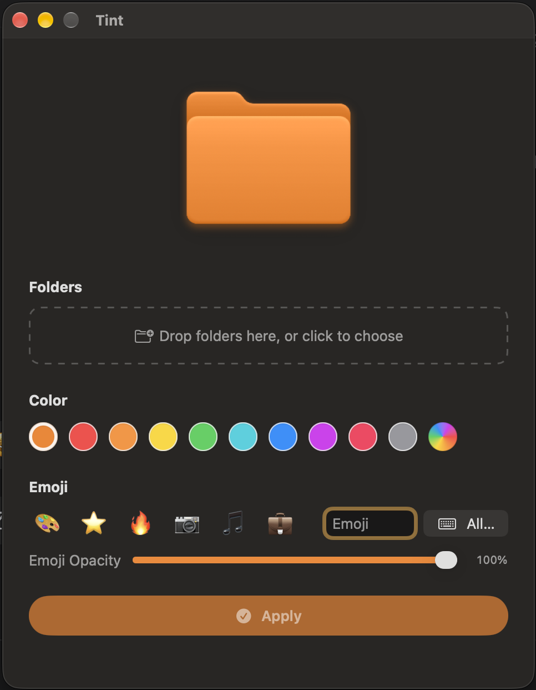

# Tint

A tiny native macOS utility to recolor folder icons and overlay an emoji — rendered from the real system folder icon, not a placeholder shape.



 [](LICENSE)

## Features

- **Recolor** any folder with a preset color, a custom color, or your **system accent color** (live-updates when you change it in System Settings)
- **Emoji overlay** with adjustable opacity
- **Batch apply** — drag & drop multiple folders, or pick them in the open panel
- **Finder Quick Action** (optional, off by default) — right-click a folder in Finder and choose *Open in Tint*
- **Detects existing custom icons** — badges customized folders and can keep editing from the current icon instead of overwriting
- **One-click restore** to the default folder icon
- **English & 简体中文** (follows system language)
- Native SwiftUI, no dependencies

## Download

Grab the latest `.dmg` from [GitHub Releases](../../releases), or build from source below.

> The app is ad-hoc signed (no Apple Developer certificate). On first launch, right-click the app and choose **Open**.

## Build

Requirements: Xcode 15 or later. [`xcodegen`](https://github.com/yonaskolb/XcodeGen) is only needed to regenerate the project file.

```sh
./build.sh          # build Tint.app
./build.sh dmg      # also produce dist/Tint.dmg
```

Or open `FolderCustomizer.xcodeproj` in Xcode and press Cmd+R.

To regenerate the app icon after editing `make_icon.swift`:

```sh
swift make_icon.swift
```

## How it works

1. Load the system folder icon (`NSWorkspace.shared.icon(for: .folder)`).
2. Clip to the folder's alpha mask and fill with the chosen color.
3. Re-apply the original's luminosity so shading and highlights are preserved.
4. Draw the emoji on top at the chosen opacity.
5. Write the result with `NSWorkspace.shared.setIcon(_:forFile:options:)`.

## Layout

| Path | Purpose |
| --- | --- |
| `Sources/FolderCustomizer/` | App source, assets, and string catalog (`en` + `zh-Hans`) |
| `project.yml` | XcodeGen project definition |
| `FolderCustomizer.xcodeproj` | Generated Xcode project |
| `build.sh` | Build + package (`.app` and optional `.dmg`) |
| `make_icon.swift` | App icon generator |

## License

[MIT](LICENSE)
